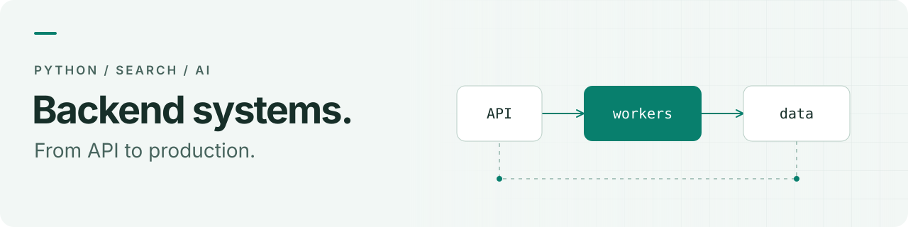

<picture>
  <source media="(max-width: 600px) and (prefers-color-scheme: dark)" srcset="assets/header-mobile-dark.svg">
  <source media="(max-width: 600px)" srcset="assets/header-mobile-light.svg">
  <source media="(prefers-color-scheme: dark)" srcset="assets/header-dark.svg">
  <source media="(prefers-color-scheme: light)" srcset="assets/header-light.svg">
  
</picture>

# Mikhail Kim

**Python Backend Engineer · Search & AI Systems**

I build backends for connected devices, search products and AI tools. My work spans API design, data pipelines, deployment and production observability.

**[Read my résumé](resume/README.md)** · **[Download PDF](https://raw.githubusercontent.com/AsianWhiteDude/AsianWhiteDude/main/resume/Mikhail-Kim-Resume.pdf)** · [Telegram](https://t.me/asian_white_dude) · [Email](mailto:kyh4uhko@gmail.com)

## Selected impact

- **500+ IoT devices monitored.** Cut offline-device detection from **8 hours to 3 minutes** with MQTT, Redis and batched alerts.
- **Faster production APIs.** Reduced p95 latency from **450 ms to 200 ms** while migrating a cloud service from Sanic to FastAPI.
- **More relevant search.** Combined BM25 and vector retrieval with reciprocal rank fusion: the correct catalog code appeared in the top 100 for **19 of 20 test queries**, up from 9.

## Experience

**YADRO · Backend Developer** 
Mar 2025 – Present

Cloud backend and IoT integration for Speechmate, a wearable audio and speech-analysis system. Python, FastAPI, Go, asynchronous processing and fleet monitoring.

**NorthCode · Backend Developer** 
Apr 2022 – Mar 2025

Hybrid search and LLM classification for a public-procurement catalog; backend services for the WAMP developer assistant, including JSON-RPC APIs, WebSocket streaming and observability.

## Selected public code

### [Pastebin](https://github.com/AsianWhiteDude/paste_bin)

Text sharing with distributed key generation, background cleanup and object storage. 
Python · Django · Flask · PostgreSQL · Celery · Redis · RabbitMQ · S3

### [Blog Generator](https://github.com/AsianWhiteDude/Blog-app)

A pipeline that turns a YouTube video into a structured article using transcription and language-model APIs. 
Python · Django · PostgreSQL · AssemblyAI · YandexGPT · S3

### [AnkiBot](https://github.com/AsianWhiteDude/AnkiBot)

An asynchronous Telegram flashcard bot for creating decks, studying and tracking progress. 
Python · Aiogram · PostgreSQL · Redis

## Toolkit

**Backend** &nbsp; Python, Go, FastAPI, Django, asyncio, REST, WebSocket, JSON-RPC 
**Data & messaging** &nbsp; PostgreSQL, Elasticsearch, ClickHouse, Redis, RabbitMQ, MQTT 
**Search & AI** &nbsp; Hybrid retrieval, embeddings, LLM integration, prompt evaluation 
**Delivery & observability** &nbsp; Docker, Linux, Nginx, GitLab CI, Prometheus, Grafana, Loki

---

[Get in touch](mailto:kyh4uhko@gmail.com) · [Read my résumé](resume/README.md)
